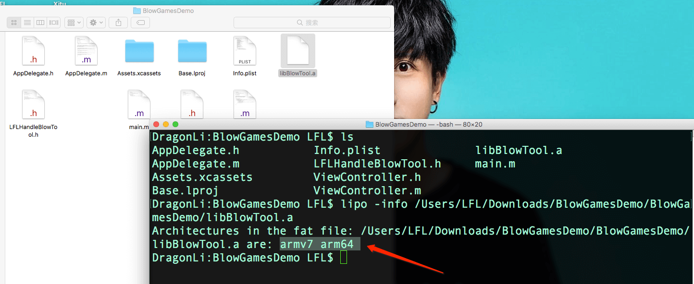

# [GitHub HomePage](https://github.com/DevDragonLi)
# 静态库

## 一. 静态库的简介

- 库, 就是讲程序代码集合, 封装为一个库文件, 他是共享代码的一种方式, 可以将自己的代码共享给他人使用

- 库的分类
	* 开源库: 公开代码, 能看到代码的具体实现
	* 闭源库:不公开代码, 将代码的实现编译为二进制文件, 只将API接口提供给使用者
		* 静态库: .a和.framework
		* 动态库: .dylib和.framework

- 静态库和动态库的区别
	- 静态库在链接时, 会被完整的复制到可执行文件中; 多次使用, 就会有多次的拷贝(import) ? 
	- 动态库则不会复制, 只有一份, 当程序运行时动态加载到内存; 系统只加载一次, 多个程序可以共用, 节省内存
	- 注意: 项目如果使用到自己的动态库, 苹果就不会上架你的APP,但是, 在WWDC2014上公布的, 苹果对iOS8开放动态加载dylib的接口, 也就是说开放了动态库挂载

		
-  静态库的主要用途

	- **保护自己的代码**: 将自己的技术分享给其他人使用, 但是又不希望自己的代码暴露给别人, 就可以使用静态库:如一些技术公司提供的SDK: 支付宝/GrowingIO...
	- 将MRC的项目, 打包成静态库, 可以直接在ARC的环境下直接使用, 不需要转换
	- 实现iOS程序的模块化。可以把固定的业务模块化成静态库。
	- 开发第三方sdk的需要

- 静态库的几个特点：

* 在App项目编译的时候会被拷贝一份编译到目标程序中，相当于将静态库嵌入了，所以得到的App二进制文件会变大。
* 在使用的时候，需要手动导入静态库所依赖的其他类库。（比如说某个SDK中使用到了CoreMotion.framework，在使用的时候需要手动导入。有的SDK需要link十几个系统库，这个时候非常恶心，只能一个一个手动加，这是静态库一个很大的不便之处。）
* 导入静态库的应用可以减少对外界的依赖，如果导入的是第三方动态库，动态库找不到的话应用就会崩掉，例如Linux上经常出现的lib not found。
* 静态库很大的一个优点是减少耦合性，因为静态库中是不可以包含其他静态库的，使用的时候要另外导入它的依赖库，最大限度的保证了每一个静态库都是独立的，不会重复引用。	
	
	
##  静态库的制作

1. 创建一个项目, 在选择工程文件时: iOS(Framework & Library) -> Cocoa Touch Static Library
2. 选择当生成静态库时, 要暴露给外人使用的头文件
3. TARGETS(项目文件) -> Build Phases -> Copy Files -> 需要暴露的头文件后面打钩(Code Sign On Copy)
4. 如果当前是模拟器环境, 编译程序的话, 就会得到模拟器状态下的静态库,如果当前是真机环境, 编译程序就会得到真机状态下的静态库
5. 编译之后, 在项目工程文件处查看, 如果Products中的.a文件是红色的, 代表创建失败
6. 如果.a文件变为白色, 代表创建成功, 右击Show In Finder就可以查看对应版本的静态库
7. 静态库的版本说明
	* Debug-iphoneos: 调试版本的真机静态库
	* Debug-iphonesimulator: 调试版本的模拟器静态库
 	* Release-iphoneos: 发布版本的真机静态库
	* Release-iphonesimilator: 发布版本的模拟器静态库
8. 生成的静态库一般包括两个文件 ,参考GrowingIO
9. include文件夹, 存放暴露出来的头文件, 有各种属性/方法的声明
10. .a文件: 将实现文件编译为二进制后生成的文件

* 
* 

## 静态库使用

### 静态库对应的CPU架构
- 模拟器:
	- 4s---5: i386架构
	- 5s---6sPlus: x86_64架构
- 真机:
	* 	4s: armv7
	* 	5/5c: armv7s(但是他兼容armv7)
	* 	5s---6sPlus: arm64

### 查看当前静态库支持的架构
- 使用终端, 进入静态库.a文件所在的目录
- 使用命令: lipo -info .a文件名称, 即可查看静态库所支持的系统架构,参考下图  
	
	
### 生成支持多个架构的静态库
	默认情况下, 需要选中不同的模拟器分别进行编译, 才会生成支持对应架构的静态库, 然后再合并静态库
- 点击TARGET项目工程文件 -> Build Settings -> Build Active -> NO
- 该选项表示不知编译活跃的架构(当前架构), 而是编译所有的架构

### 生成一个既支持模拟器又支持真机的静态库
- 由于静态库针对于模拟器和真机, 生成的静态库版本是不一样的(为了不同的CPU架构), 因此无法同时运行

- 静态库的合并
	- 在终端, 使用lipo -info .a文件名称的方法, 查看静态库的版本
	- 合并.a文件

```
lipo -create Debug-iphoneos/libBlowTool.a Debug-iphonesimulator/libBlowTool.a -output libBlowToolNew.a

文件合并之后, 可以查看该静态库目前已经支持armv7 i386 x86_64 arm64
```	
	

## 静态库开发中遇到的常见问题

- 一些静态库包含的资源文件可能与我们自己的资源文件重名

	* Xcode在编译的时候, 会把所有的资源文件导入mainBundle中, 这样可能出现重名冲突
	* 因此在静态库中使用图片素材, 需要利用bundle文件
	* 建立一个bundle文件, 然后向其中添加静态库所需的图片
	* 在库中创建一个类方法, 返回图片
	* 编译
	* 外界如果需要使用图片, 需要导入.h + .a + XXX.bundle文件

- 如果用户需要导入的头文件过多, 就可以使用一个主头文件, 包含其他所有的头文件, 这样用户只需要导入一个主头文件就可以了	
- Swift不支持静态库? (只要思想不滑坡,办法总比困难多) 
	* Xcode只要加入Swift文件就压根编译不过会报Swift is not supported for static libraries
   * 其实OC调用Swift,系统也是帮我们把Swift转换成OC再来编译，那么是不是我们只需要拿到Xcode编译过后的文件，然后就算删除掉Swift库也可以正常运行呢，我的测试是是的。所以打包静态库也是如此。

   
## 解压静态库.a文件   

```
1. 	file libBlowTool.a 
libBlowTool.a: Mach-O universal binary with 2 architectures: [arm_v7: current ar archive random library] [arm64: current ar archive random library]
libBlowTool.a (for architecture armv7):	current ar archive random library
libBlowTool.a (for architecture arm64):	current ar archive random library
DragonLi:Desktop LFL$ lipo libBlowTool.a -thin armv7 -output v7.a

2. 抽离object的时候必须是要单一的库，所以这里我们之抽出armv7并命名为v7.a
	lipo libBlowTool.a -thin armv7 -output v7.a
3. 抽离.a文件的object,多出一些.o文件
	 ar -x v7.a   
4. nm libBlowTool.o > libBlowTool.m

```


